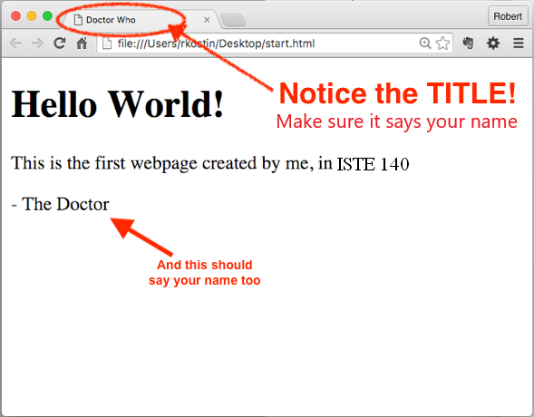

# Lab 1: Account Setup
*Due: Tuesday, August 31, 2021* 

Your assignment is to login and use your account on our class web server and practice the steps to create and upload files to the World Wide Web.

## Step 1: Get an FTP account

Your **FTP (File Transfer Protocol) account** is what you will use to copy your web files from your computer to the class web server throughout the semester.  

- <s>To get your account, contact your TA via DM in Slack...</s>

The professor has already setup everyone's FTP account.  Your FTP credentials (the information you need to login) is as follows:

- Server (sometimes called the "host"): **ftp.iste140.org**
- Port (this is usually already set depending on the software you're using): **21**
- FTP username: **\<yourRITuserid>@iste140.org**
  - Your username looks like an email address but it isn't!  It's that whole thing that acts as your FTP username, e.g. **`rmkics@iste140.org`**
- FTP password: **<see the #announcements channel in Slack>**
  - For now, we're all using the same password, but when you get a chance, meet with the professor to change your password to whatever you want

You will need this information^ (above) for the rest of the semester!  Keep it handy.

## Step 2: Create a simple webpage and view it in a web browser

On your desktop or anywhere in your computer’s file system where you plan to keep your ISTE-140 lab assignment files, create a new HTML file.

*NOTE: before proceeding, make sure your computer's operating system is showing "file extensions."  If you don't know what that is or how to turn them on, ask about it in the #help channel in Slack.*

Create your first HTML file...

- On a PC
  - Right mouse-click anywhere on the Windows desktop and select “New” and then “Text Document”
  - Change the full name of the document from New Text Document.txt (including the extension) to: **start.html**
  - Click Yes to the warning dialog that pops-up.
  - Using a code editor (like [Sublime Text](https://www.sublimetext.com/3)), open the **start.html** file.
    - NOTE: if you have a preference, you can use whatever code editor you like; the professor will be using Sublime Text during demos.
- On a Mac
  - Open a code editor (like [Sublime Text](https://www.sublimetext.com/3))
    - NOTE: if you have a preference, you can use whatever code editor you like; the professor will be using Sublime Text during demos.
  - Save the current (empty) file to your Mac desktop using the filename: **start.html**
- In your code editor, enter the following text exactly as shown in the code-box below
  - Mimic the indentations using tabs or spaces (it doesn’t matter which you use - just try to line-up the text as shown)
  - Where it says “Enter Your Name” (in two places), enter *your* name
  - Note: the "h1" is the letter "h" and the number "1", not a lowercase L
  - Also note: you need ALL the code below, starting with the `<!doctype...` thing at the top...

```html
<!doctype html>

<html>

	<head>
		<meta charset="utf-8">
		<title>Enter Your Name</title>
	</head>

	<body>
		<h1>Hello World!</h1>
		<p>This is the first webpage created by me, in CSC 170.</p>
		<p>- Enter Your Name</p>
	</body>

</html>
```

- Save the file  
- Open the **start.html** file in a web browser (double click it).  You should see something like this...<br>

If there are problems, check your handiwork for mistakes in the code editor.  Then re-save and refresh the web browser.

If it all looks good, close the code editor and web browser before continuing.

## Step 3: Access your FTP account using FTP Software

You will copy your **start.html** file from your computer to the class web server by "FTP-ing" it using software that must be installed on your computer.  There are lots of kinds of FTP software you can use.  If you already know about this and have your own preference, you can use it.  Else, if it doesn't matter:

- Use **WinSCP** for Windows
- Use **Cyberduck** for Mac

To install your own: **WinSCP** (Windows only) go to [winscp.net/eng/download.php](http://winscp.net/eng/download.php)<br>...then click the green button, “DOWNLOAD WINSCP...”

To install **Cyberduck** go to: [cyberduck.io](http://cyberduck.io)<br>
...then click “Download,” for Windows or OS X

- Use your FTP software to login to your account using the FTP credentials from Step 1 above.

If you were successful, your FTP client will connect you to the file space on the web server where you will put your web files.  Any files in that space will be accessible on the Web.

## Step 4: Upload and check your HTML document

- In the file system of your computer (e.g. on the Desktop - or wherever you're working), find your **start.html** file into and drag it the open FTP window to upload it to your account on the web server.

- Open a web browser and go to this web address, below, where “*username*” is your RIT computer username that you created in Step 1 (example: **rmkics** -- *not* your FTP login with the @...)

   `www.iste140.org/username/start.html`

If you did everything correctly, you should see your simple webpage with your name on it. 

## Step 5: Log your work in MyCourses
To receive credit for this lab, go to the Assignments tab in our MyCourses section, and in the **Lab 1: Account Setup** assignment and copy & paste a link (i.e. the URL) to your start.html file on the class web server in the **Text Submission** box.  
